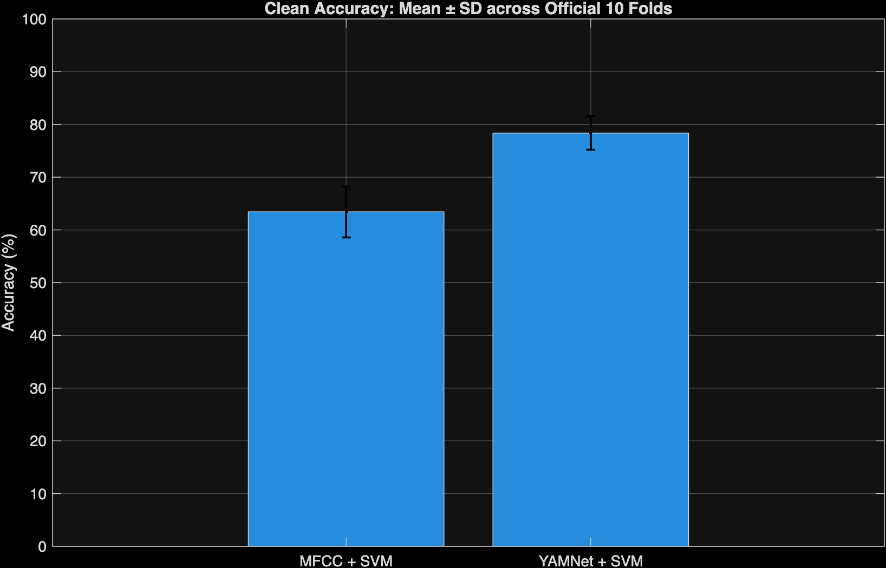
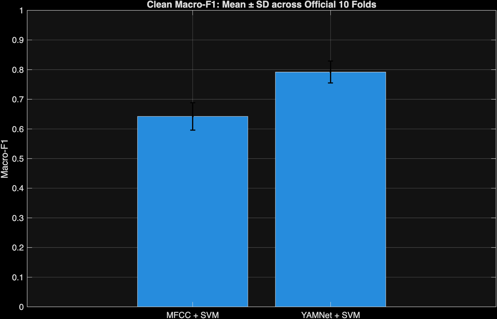
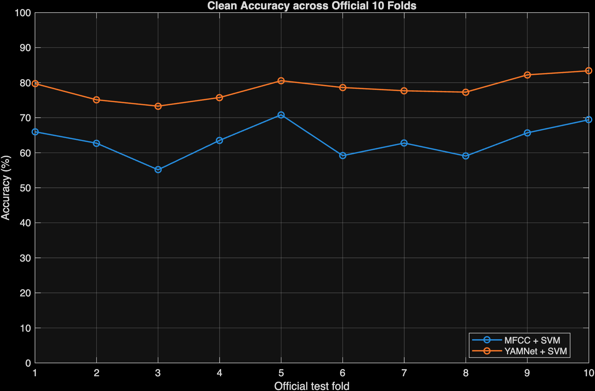
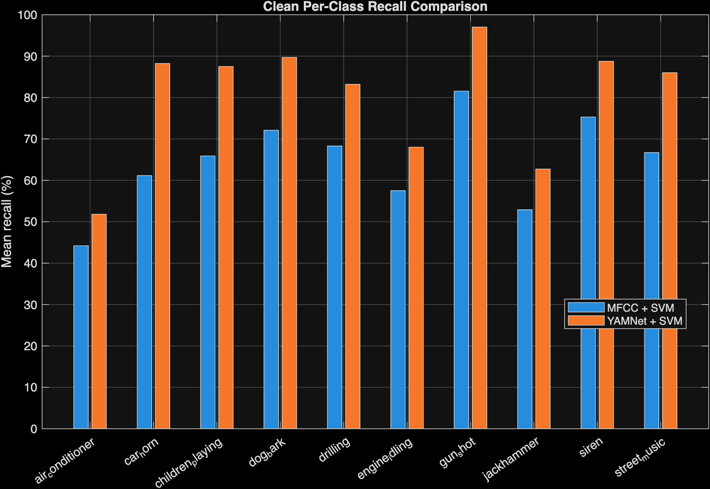

# Elec5305-project-530087661
Student: Yunzhe Shao (SID: 530087661)

**GitHub Repository:** [View Repository](https://github.com/ysha0293/elec5305-project-530087661)

**GitHub Pages:** [View Project Website](https://ysha0293.github.io/elec5305-project-530087661/)

## MFCCs versus Pretrained Audio Embeddings: Robustness of Environmental Sound Classification
This project studies the classification of the environmental sound classification based on the Urbansound8K dataset

This project initially focuses on comparing different audio features and machine learning methods by classification accuracy.

Based on the project feedback one, The main research focus of the current project has been adjusted to:

Study the robustness of different audio representation methods when the acoustic environment or recording conditions change.

The current project mainly compares:
- traditional MFCC features
- pretrained YAMNet audio embedding

These two representation methods are evaluated using a simple SVM classifier.

The goal of this project only only compares the classification performance under the condition of clean data, and further studies how do noise, reverb and channel effects affect audio representation and final classification performance.

---
## Research question

### main research probelm:
**How robust are conventional MFCC features and pretrained deep audio embeddings to realistic acoustic and recording-channel perturbations in environmental sound classification?**
### secondary question:
**Can changes in the audio representation predict when classification performance will fail?**


## Dataset

This project uses the UrbanSound8K dataset.

UrbanSound8K includes:

- 8732 labeled audio segments;
- 10 environmental sound categories;
Each audio segment is approximately 4 seconds long.
- 10 pre-defined official folds.

The 10 categories are respectively:

1. Air Conditioner
2. Car Horn
3. Children Playing
4. Dog Bark
5. Drilling
6. Engine Idling
7. Gun Shot
8. Jackhammer
9. Siren
10. Street Music

The UrbanSound8K dataset can be downloaded from Zenodo:

[Download UrbanSound8K Dataset](https://zenodo.org/records/1203745)

The expected directory structure of the dataset is as follows:
```text
UrbanSound8K/
├── audio/
│ ├── fold1/
│ ├── fold2/
│ ├──...
│ └── fold10/
│
└── metadata/
    └── UrbanSound8K.csv
```
The original audio file of UrbanSound8K will not be uploaded to this GitHub.

---
## The connection with ELEC 5305

This project is directly related to mutiple audio signal processing learned in the elec5305, including:

- Audio preprocessing
- Sampling and resampling
- Short-term analysis
- Window function
- Fourier spectrum analysis
- Spectrogram
- Filterbank
- MFCC
- Signal-to-Noise Ratio
- Convolution and reverberation
- Channel effect and frequency response effect

Especially during the extraction process of MFCC, This project will not merely use MFCC as a MATLAB function.

The main signal processing process of MFCC is :
```text
Audio
  ↓
Short-time frames
  ↓
Windowing
  ↓
Fourier spectrum
  ↓
Mel filterbank
  ↓
Log energies
  ↓
DCT
  ↓
MFCC
```

It can connect the environmental sound classification task with the signal processing content learned in elec5305 directly.

---
## System A：MFCC + SVM
The first system uses the traditional manual design of audio features.

Current MFCC representation includes:

- MFCC coefficients;
- First-order MFCC deltas;
- Statistical summary based on the time dimension

The extracted features use Support Vector Machine (SVM) to classify.

The purpose of this system is to provide a traditional dsp baseline with strong interpretability.

The whole process is:

```text
Audio
  ↓
Preprocessing
  ↓
MFCC extraction
  ↓
Feature statistics
  ↓
SVM
  ↓
Predicted sound class
```

---

## System B：pretrained YAMNet Embeddings + SVM

The second system uses the pretrained YAMNet model.

YAMNet is used as the frozen feature extractor in this project, instead of being trained from scratch.

The whole process is :

```text
Audio
  ↓
Pretrained YAMNet
  ↓
Audio embeddings
  ↓
Embedding statistics
  ↓
SVM
  ↓
Predicted sound class
```

MFCC and YAMNet use similar simple downstream classifiers, which can make the experiment to compare different audio representations more intensively rather than comparing the complexity of classifiers

---

## Official 10-Fold Evaluation

This project always uses the fold structure of the official urbansound8k.

Random train / test spilt will not be re-created.

In each evaluated process:

1. choose a official fold as the held-out test fold
2. the left 9 folds are used for training
3. Repeat the process for all 10 folds

The main evaluation indicators include:
- Accuracy;
- Macro-F1;
- Per-class Recall;
- Confusion Matrix;
- the average of 10 folds;
- 10 standard deviations of folds.

Due to the fact that the difficulty of UrbanSound8K may vary among different folds, this method can avoid  the result which can only rely on one fold.

---

## Initial Clean Benchmark

Currently, I have used the official 10-fold protocol to compare clean-condition evaluation.

| Method | Mean Accuracy | Mean Macro-F1 |
|---|---:|---:|
| MFCC + SVM | **63.43 ± 4.82%** | **0.642 ± 0.047** |
| YAMNet + SVM | **78.37 ± 3.19%** | **0.792 ± 0.037** |

Current clean results indicate that the average classification performance of pretrained YAMNet embeddings is higher than MFCC featrues.

However, The main goal of this project is not to determine which method can achieve the highest clean accuracy.

The next phase will futher study that When the recording conditions change, whether these audio representations still maintain reliable classification performance.

---

## Clean Benchmark Figures

### Averge Accuracy



### Averge Macro-F1



###  Accuracy in Official Folds



### Per-Class Recall



---

## The planned robustness experiment

After building clean benchmark, the next phase will evaluate the robustness of model under the different recording conditions.

The classifer still uses the clean UrbanSound8K audio to train.

Only held-out test recordings will be gradually added to the perturbation.

The following types of disturbances are initially planned to be used:

### Background Noise

Add controlled environmental noise with different SNR levels to the test audio.

Initial plain uses:

- 20 dB SNR；
- 10 dB SNR；
- 0 dB SNR

### Reverberation

Add reverb to the audio through Room Impulse Response.

### Channel / Frequency-Response Distortion

Simulate the situation where the frequency response of the microphone or recording channel changes through controlled filtering.

MFCC and YAMNet will use exactly the same perturbed waveform for feature extraction to ensure that the comparison process is strictly controlled.

---

## Robustness analysis

For each types of audio representation, we will compare the clean performance with perturbed performance.

The decline in robustness can be expressed as:

```text
Robustness Drop
=
Clean Performance
-
Perturbed Performance
```

we will mianly study that the changes in classification performance as the degree of disturbance increases.

This project will further analysis:

Which environmental sound categories are particularly sensitive to different types of disturbances.

Confusion matrices, waveforms, spectra, spectrograms and MFCC representations will be used to help explain significant classification errors.

---

## Representation Change

This project will also study that:

When the category to which the sound itself belongs remains unchanged but the recording conditions change, how much has the audio representation itself changed.

For MFCC features, we can measure them by the distance between the clean feature summary and perturbed feature summary.

For YAMNet embeddings, we can use cosine distance to compare the clean representation with perturbed representation.

Then, we will futher compare:

```text
Representation Shift
        ↓
Classification Performance Loss
```

By simple correlation analysis, we can study whether bigger representation change is related to the decrease of bigger Macro-F1.

---

## Current progress

- [x] UrbanSound8K dataset preparation
- [x] Metadata loading
- [x] Dataset inspection
- [x] Audio preprocessing
- [x] Waveform / spectrum / spectrogram analysis
- [x] MFCC extraction
- [x] MFCC + SVM baseline
- [x] Pretrained YAMNet setup
- [x] Frozen YAMNet embedding extraction
- [x] YAMNet + SVM classification
- [x] Official 10-fold evaluation
- [x] Clean Accuracy evaluation
- [x] Clean Macro-F1 evaluation
- [x] Per-class Recall
- [x] Confusion Matrix
- [x] Mean ± Standard Deviation across folds
- [ ] Background-noise robustness
- [ ] Reverberation robustness
- [ ] Channel-distortion robustness
- [ ] Representation-distance analysis
- [ ] Representation-shift / performance correlation

---

## Repository Structure

```text
code/
├── main.m
├── config.m
├── test_setup.m
├── dataset/
├── features/
├── evaluation/
├── experiments/
├── perturbations/
├── analysis/
├── plots/
└── utils/

results/
├── figures/
└── tables/
```

`code` folder contains the main implementation code of the project.

The 'results' folder contains the tables and images generated and filtered by the experiments.

---

## MATLAB Requirements

Current project use the MATLAB to implement.

The project requires the following relevant functions in Toolbox:

- Audio Toolbox
- Signal Processing Toolbox
- Statistics and Machine Learning Toolbox
- Deep Learning Toolbox

At the same time, TAMNet feature extraction needs to install pretrained YAMNet support model.

The relevent MATLAB resources:

[Audio Toolbox Pretrained Models](https://www.mathworks.com/help/audio/pretrained-models.html)

[Transfer Learning with Pretrained Audio Networks](https://www.mathworks.com/help/audio/ug/transfer-learning-with-pretrained-audio-networks.html)

---

## Experimental reproduction instructions

### 1. Clone Repository

```bash
git clone https://github.com/ysha0293/elec5305-project-530087661.git
```

### 2. Download UrbanSound8K

Dataset download address:
[UrbanSound8K Dataset - Zenodo](https://zenodo.org/records/1203745)

Place the decompressed dataset in the project directory.

The expected structure is as follows:

```text
project/
├── code/
├── UrbanSound8K/
│   ├── audio/
│   │   ├── fold1/
│   │   ├── ...
│   │   └── fold10/
│   └── metadata/
│       └── UrbanSound8K.csv
└── results/
```

### 3. Install YAMNet Support Model

we need to make sure matlab audio toolbox can use YAMNet normally.

we cna pass the testing by following codes:

```matlab
[net,classes] = audioPretrainedNetwork("yamnet");
```

### 4. Run the Setup Check

```matlab
cd code
test_setup
```

This command will check:

- dataset paths；
- metadata；
- official folds；
- MATLAB required functions；
- YAMNet availability。

### 5. run the clean benchmark

```matlab
main
```

The experiment results will be saved into:

```text
results/tables/
results/figures/
```

---

## The following work

The following work mainly includes:

1. Controlled background-noise experiment;
2. reverberation Experiment;
3. channel/frequency-response Experiment
4. representation-distance analysis;
5. correlation analysis between representation shift and classification degradation
6. class-level robustness analysis.

This project finally wants to determine:

Is the audio representation with the best classification performance under the clean condition also the most stable representation when the recording conditions change?

---

## Project Documents

[Project Proposal(project feedback 1) (PDF)](ELEC5305_Project_Proposal(Yunzhe%20Shao-530087661).pdf)

## References and Resources

1. J. Salamon, C. Jacoby, and J. P. Bello,  
   *A Dataset and Taxonomy for Urban Sound Research*, ACM Multimedia, 2014.

2. [UrbanSound8K Dataset - Zenodo](https://zenodo.org/records/1203745)

3. [MATLAB Audio Toolbox Pretrained Models](https://www.mathworks.com/help/audio/pretrained-models.html)

4. [MATLAB Transfer Learning with Pretrained Audio Networks](https://www.mathworks.com/help/audio/ug/transfer-learning-with-pretrained-audio-networks.html)

5. [YAMNet Transfer Learning Tutorial](https://www.tensorflow.org/tutorials/audio/transfer_learning_audio)

6. [A Study on Robustness to Perturbations for Representations of Environmental Sound](https://arxiv.org/abs/2203.10425)


